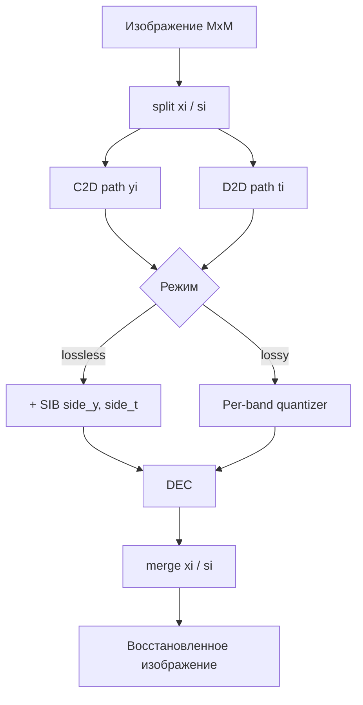

# Архитектура L2L DCT-ODCT

## Обзор

Система реализует трансформационный кодер изображений по схеме **L2L** (lossless-to-lossy) с единым ядром **ДКП-II / ОДКП-III** на базе блочной лестничной параметризации.

## Модули Python

| Модуль | Назначение |
|--------|------------|
| `fixed_point.py` | Q16.16, ladder_round (узел округления) |
| `dct/reference.py` | Матрицы C, D (ДКП-II / ОДКП-III) |
| `dct/loeffler_8pt.py` | Быстрый 1-D/2-D DCT (матричная форма; HLS — flowgraph) |
| `ladder/block_ladder_*.py` | Блочная лестничная параметризация |
| `ladder/sib.py` | Side Information Block |
| `l2l/analysis.py` | Прямой L2L-проход |
| `l2l/synthesis.py` | Обратный L2L-проход |
| `l2l/codec.py` | Lossless / lossy кодирование |

## Fixed-point

- Пиксели: uint8 → Q16.16 (`to_fixed`)
- Узел округления ladder: `ladder_round` (потеря 15 младших бит дробной части)
- SIB хранит `(coeff_exact - coeff_quantized)` для каждого пути C2D и D2D

## Эффект «шахматной доски»

Без SIB ошибки округления на путях C2D/D2D накапливаются и проявляются как **блочная сетка** 8×8 (DC leakage / потеря регулярности 1-го порядка, §5.6 методички).

С SIB side information восстанавливает точные коэффициенты → PSNR = ∞.

## FPGA

- **HLS:** `fpga/hls/loeffler_dct_8pt.cpp` — 8-точечный DCT-II
- **Pynq:** AXI-Lite + BRAM, драйвер `l2l_driver.py`
